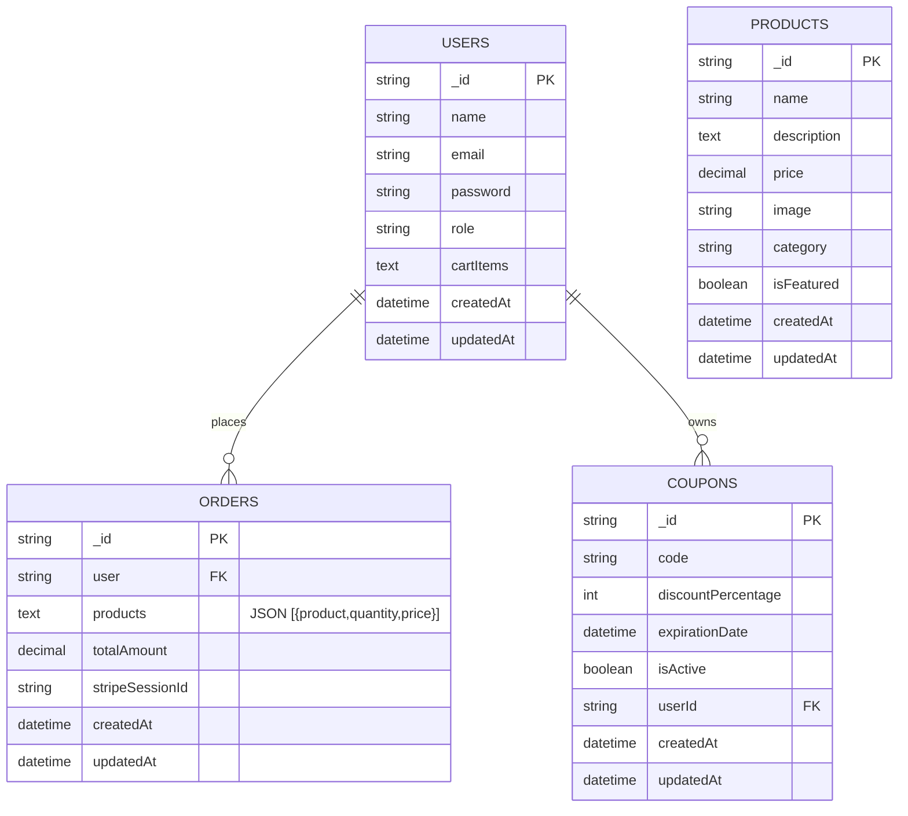

# E-Commerce Store ERD

This document describes the logical data model and relationships. The implementation uses a portable DAO layer with migrations targeting both SQLite and SQL Server. Some denormalization is intentionally used (e.g., order line items stored as JSON text) to keep DAO APIs simple across engines.

## Entities

### users
- `_id` (PK, string UUID)
- `name` (string)
- `email` (string, unique)
- `password` (string, bcrypt hash)
- `role` (enum: `customer` | `admin`)
- `cartItems` (TEXT JSON: `[{ productId, quantity }]`)
- `createdAt` (datetime)
- `updatedAt` (datetime)

Indexes:
- `idx_users_email` on `email`

### products
- `_id` (PK, string UUID)
- `name` (string)
- `description` (text)
- `price` (decimal)
- `image` (string URL; Cloudinary `secure_url`)
- `category` (string)
- `isFeatured` (boolean/integer)
- `createdAt` (datetime)
- `updatedAt` (datetime)

Indexes:
- `idx_products_category` on `category`
- `idx_products_featured` on `isFeatured`

### orders
- `_id` (PK, string UUID)
- `user` (FK-like string: references `users._id`)
- `products` (TEXT JSON of `{ product, quantity, price }[]`)
- `totalAmount` (decimal)
- `stripeSessionId` (string unique)
- `createdAt` (datetime)
- `updatedAt` (datetime)

Indexes:
- `idx_orders_user` on `user`
- `idx_orders_stripe_session` on `stripeSessionId`

### coupons
- `_id` (PK, string UUID)
- `code` (string unique)
- `discountPercentage` (integer)
- `expirationDate` (datetime)
- `isActive` (boolean/integer)
- `userId` (FK-like string: references `users._id`)
- `createdAt` (datetime)
- `updatedAt` (datetime)

Indexes:
- `idx_coupons_code` on `code`
- `idx_coupons_user` on `userId`

## Relationships
- `users` 1—N `orders`: `orders.user` references `users._id`.
- `users` 1—N `coupons`: `coupons.userId` references `users._id`.
- `orders` N—(embedded) `products`: order line items stored as JSON, where `product` contains `products._id`.
- `users` — cart items are stored as JSON inside `users.cartItems` with `productId` and `quantity`.

## Diagram (Mermaid)

## Normalization Notes
- Order items and cart items are stored as JSON for portability across SQLite/SQL Server and to simplify DAO operations.
- If you need strict relational joins, introduce tables:
  - `order_items(order_id, product_id, quantity, price)`
  - `cart_items(user_id, product_id, quantity)`

## Migrations
- Defined in [src/databases/migrations/migrations](src/databases/migrations/migrations)
- Managed by [MigrationManager](src/databases/migrations/MigrationManager.ts)
